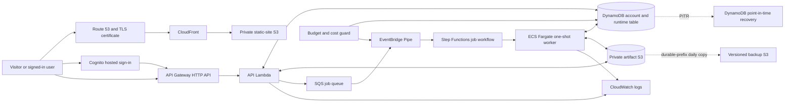
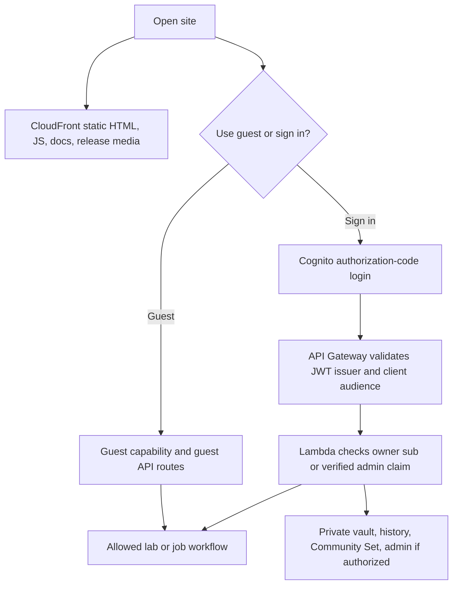
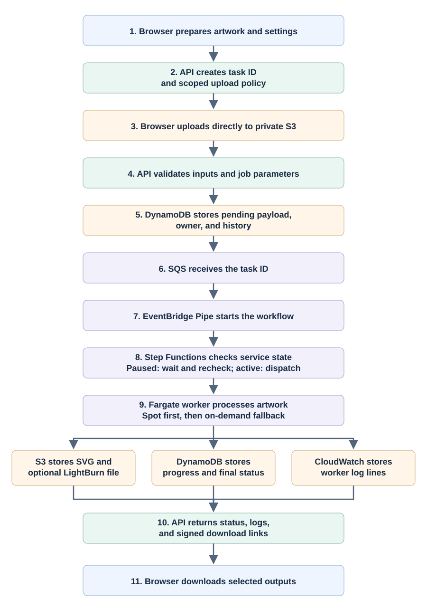
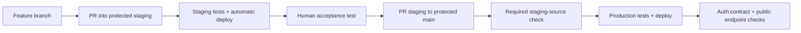

# MOPA Laser Rasterizer production handover

**Purpose:** architecture, data ownership, release, operations, recovery, and ownership-transfer training for the production service. This describes the hosted application, not the optional local/CLI runtime.

**Baseline:** repository `main` at `22e4306`; read-only AWS checks on 2026-09-18 in account `401716294893`, Region `us-east-2`. CloudFormation stack status, selected configuration, public HTTP response, and service status were checked live. A successful end-to-end job, sign-in, and the latest GitHub Action conclusion were **not** re-tested for this document. Physical resource IDs and operational state can change; rediscover them before acting. Never put passwords, access tokens, or user uploads in this guide.

## 1. What this service is

The browser application turns raster artwork into color-separated laser vector geometry. Users can route colors to different image treatments and geometry styles, optionally associate LightBurn material-library settings, and obtain layered SVG and (when applicable) LightBurn `.lbrn2` projects. It also exposes Color Discovery, Fauxlographic Etching, depth/relief, saved palette/library, and Community Set workflows. It **generates files; it does not drive a laser**. The authoritative feature overview and user instructions are in the [README](../README.md) and the site documentation.

Production is a serverless AWS application: private static S3 behind CloudFront, an HTTP API on API Gateway and Lambda, Cognito sign-in, private artifact S3, a single-table DynamoDB store, SQS/Step Functions dispatch, and one-shot ECS Fargate workers. There is no required production EC2 or K3s node.

### System map



The browser loads site files through CloudFront but calls the API Gateway origin directly. It receives time-limited S3 upload/download instructions from Lambda; large artwork and finished files do not pass through the API Lambda. Cognito provides identity, not application data storage. The `sub` claim, not an email address, is the durable account owner key.

## 2. Production resource and control hierarchy

| Layer | Live production resource / stack | Responsible for | Normal change path |
| --- | --- | --- | --- |
| Domain and certificate | `mopa-laser-rasterizer.com`, `www`; Route 53; CloudFront ACM certificate in `us-east-1` | DNS and HTTPS. These are external release dependencies. | Administrator-controlled; **not** routine GitHub release. |
| Existing identity | Cognito user pool `mopa-laser-rasterizer-users` (`us-east-2_RF3YztB0J`) | Accounts and OAuth identity. The web stack creates/configures the app client, not the underlying pool. | Carefully administered; preserve `sub` values. |
| Existing data | DynamoDB `mopa-laser-rasterizer-users`; S3 `mopa-laser-rasterizer-artifacts-401716294893` | Durable vault plus ephemeral jobs and artifacts. Passed into the foundation; not recreated by it. | Separately protected; never delete as a routine stack reset. |
| Foundation | `mopa-rasterizer-serverless-production` | Private static bucket, encrypted SQS queue and dead-letter queue. | Administrator for structural changes. |
| Worker | `mopa-rasterizer-serverless-production-worker` | ECR-backed Fargate task definition, ECS cluster, task IAM, networking, CloudWatch worker log group. | GitHub production application release for updates. |
| Orchestration | `mopa-rasterizer-serverless-production-orchestration` | SQS-to-Step Functions Pipe and job state machine. | GitHub production application release for updates. |
| Web/API | `mopa-rasterizer-serverless-production-web` | CloudFront, API Gateway, JWT routes, API Lambda, Cognito client and public URLs. | GitHub production application release for updates. |
| Cost control | `mopa-rasterizer-serverless-production-cost-guard` | Shared $100 monthly budget notification, per-environment service controls, operator notifications. | Separate administrator deployment. |
| Durable backup | `mopa-rasterizer-serverless-production-backups` | Daily scoped S3 copy, versioned backup bucket, failure alarm. | Separate administrator deployment. |

Production site: <https://mopa-laser-rasterizer.com/>. The web stack output currently names API `https://dg0y470rp0.execute-api.us-east-2.amazonaws.com`, but the **CloudFormation output is the source of truth**. Its public `GET /service-status` endpoint reported `active` / `processing_available: true` in the 2026-09-18 check. All six named production stacks above were `CREATE_COMPLETE` or `UPDATE_COMPLETE`; the production Pipe was `RUNNING`. These are point-in-time observations, not continuous monitoring.

The static bucket is an origin, **not** a public website bucket. CloudFront uses restricted origin access. The artifact bucket is separate so generated files and uploaded libraries are not served as public static assets. Production browser access is not gated by the staging Basic-auth gate; guest processing is enabled in the production web-stack parameter.

### Environments are isolated, not backups of each other

The `serverless-staging` environment has separate identity, DynamoDB, artifact S3, queue, worker, orchestration, and web resources. Its Cognito pool is invite-only. Staging is the acceptance gate for releases, **not** a production backup or source of production account data. A cost-guard action can pause one environment without intentionally pausing the other; the monthly AWS budget is account-wide.

## 3. Identity, authorization, and browser routes



- Public site, documentation, release media, `GET /service-status`, and guest configuration require no account. Production permits specified guest job/lab routes, with a short-lived capability and quotas; a guest capability is **not** a Cognito account.
- Signed-in account routes require a Cognito JWT at API Gateway and owner checks in Lambda. Job ownership and vault records key on Cognito `sub`. Admin routes require the configured **verified** admin-email claim in addition to JWT validation; email alone is not the database owner key.
- The API issues presigned S3 POSTs for scoped uploads (10 minutes) and presigned GETs for downloads (15 minutes). It enforces file/size constraints and validates the uploaded object before final submission. Current API defaults are 100 MiB artwork and 10 MiB material/recipe; verify live Lambda environment for any override.
- A web release must preserve the production Cognito callback/logout origins, including the apex and `www` hostnames. Past production sign-in failures were caused by deployment configuration drift. The release script explicitly avoids routine Cognito domain/branding changes and tests the production authentication contract; sign-in from a docs page should return to that page.

See [`ecs/serverless-staging-web.yaml`](../ecs/serverless-staging-web.yaml) (shared parameterized web template), [`serverless_api/handler.py`](../serverless_api/handler.py), and [`docs/github-actions-production-deployment.md`](github-actions-production-deployment.md).

## 4. Complete job lifecycle



1. **Prepare.** In the browser, the user chooses artwork, output mode, material library or SVG-only, swatches, image filters, output geometry, cropping, and any lab-derived parameters. The UI's configuration is not the execution record until it is submitted.
2. **Upload.** Lambda creates a `JOB#<task-id>/RUNTIME` record in `uploading` state and returns an upload capability plus presigned POST policy. The browser uploads directly to the private artifact bucket under `jobs/<task-id>/inputs/...` or an account-owned job prefix. An import has a separate staging/finalize route.
3. **Submit.** Lambda verifies capability, ownership, objects, file size/type and job parameters, then stores the payload in DynamoDB, creates account/admin history indexes where applicable, marks `pending`, and puts the task ID—not the full image—on the production SQS queue.
4. **Dispatch.** An EventBridge Pipe sends one direct task-ID queue message to the Standard Step Functions job state machine. That checks `SYSTEM#SERVICE/CONTROL`; if paused, it returns the task to SQS with a five-minute delay and ends, avoiding a transition-consuming polling loop while the stopped Pipe leaves the job queued. It prefers Fargate Spot, retries Spot as configured, then falls back to on-demand Fargate. A failed terminal path marks the job failed and sends its task ID to the DLQ. SQS retry/redrive and the worker runtime lease help prevent concurrent duplicate execution.
5. **Process.** The one-shot container runs `worker.py --task-id <id>`, loads the payload and source objects, invokes the raster/vector pipeline, uploads output artifacts, and changes the runtime/history status. Processing code lives chiefly in [`services.py`](../services.py) (`long_running_script`), [`lib/vector_processing.py`](../lib/vector_processing.py), [`lib/geometry_styles.py`](../lib/geometry_styles.py), [`lib/abstract_filters/`](../lib/abstract_filters/), and [`lib/lightburn.py`](../lib/lightburn.py). Special calibration/grid endpoints may render in API Lambda; do not assume every lab action launches Fargate.
6. **Observe/download.** The browser polls the job API. Worker log lines go to `/ecs/mopa-rasterizer-serverless-production-worker` in CloudWatch, while DynamoDB holds the log-stream reference and status; it is **not** the per-line worker log sink. The API summarizes user-facing failure and can also return raw recent log lines. Successful outputs are returned as short-lived signed S3 URLs. Users download whichever formats they need.

The live production job queue had zero visible and zero in-flight messages when checked on 2026-09-18. That is only a snapshot. The production foundation configures 7-day SQS source retention, 14-day DLQ retention, visibility timeout 7,200 seconds, and redrive after three receives.

## 5. Data hierarchy and lifecycle

The production DynamoDB table is a single table with string partition key `pk` and sort key `sk`. A record's `expires_at` field participates in TTL **only if present**. TTL is currently `ENABLED` on `expires_at`; it must remain selective. **Never add TTL to durable material-library, palette, community, preference, or service-control records.** DynamoDB TTL expiration is asynchronous; application/UI retention windows and S3 lifecycle are separate mechanisms.

```text
AWS account 401716294893 / us-east-2
├─ Cognito pool: identity and stable user sub
├─ DynamoDB: mopa-laser-rasterizer-users (pk, sk)
│  ├─ USER#<sub>
│  │  ├─ PREFERENCES                         durable
│  │  ├─ MATERIAL#<id>                       durable material-library metadata
│  │  ├─ DEPTHPALETTE#<id>                   durable depth-palette metadata
│  │  ├─ HOLORECIPE#<id> / HOLOCALIBRATION#<id> durable lab records
│  │  ├─ JOB#<time>#<task-id>                7-day job history
│  │  ├─ COLORDISCOVERY#<id>                 7-day grid record
│  │  └─ IMPORT#<id>                         15-minute import staging
│  ├─ JOB#<task-id> / RUNTIME, OWNER          7-day job state/ownership;
│  │                                         guest runtime can be 24 hours
│  ├─ ADMIN#JOBS / JOB#...                   job administration index, expiring
│  ├─ LASER_COMMUNITY / MATERIAL#..., PALETTE#... durable shared records
│  ├─ quota, fingerprint, and session keys   scoped/expiring operational records
│  └─ SYSTEM#SERVICE / CONTROL                durable service pause state
├─ Artifact S3: mopa-laser-rasterizer-artifacts-401716294893
│  ├─ jobs/<task-id>/...                      guest/temp job objects; 7-day lifecycle
│  └─ users/<sub>/
│     ├─ jobs/<task-id>/...                   tagged job objects; 7-day lifecycle
│     ├─ materials/...                        durable library files
│     ├─ holographic-recipes/...              durable recipe files
│     └─ holographic-calibrations/...         durable calibration files
├─ Static-site S3 /web/...                    rebuildable site, docs, media, API zip
└─ Separate versioned backup S3               daily copies of three durable prefixes
```

The tree is a representative ownership map, not a complete list of every internal item variant or generated file. Always inspect code/schema and actual records before a migration. Saved vault metadata and its S3 object must be kept together. Some data (for example depth/color palette payloads) may live entirely in DynamoDB rather than having a paired S3 file. Community data is shared, not under an individual `USER#<sub>` partition.

| Data class | Intended lifetime | Where and how it is protected |
| --- | --- | --- |
| Signed-in job runtime/history | 7 days | DynamoDB `expires_at`; artifact `jobs/` prefix or `mopa-retention=job` tag expires at 7 days. |
| Guest job/capability | 24 hours by API default; S3 object deletion follows bucket lifecycle | Capability and runtime have short expiration; do not promise instant S3 deletion after 24 hours. |
| Temporary library import | 15 minutes | `IMPORT#` DynamoDB TTL; upload policy has its own 10-minute lifetime. |
| Durable account vault and Community Set | No job TTL | Production DynamoDB PITR; selected durable S3 prefixes have daily separate backup. |
| Worker logs | Worker log group default 7 days | CloudWatch, not thousands of DynamoDB log-row writes per job. |
| Static site and release media | Until replaced/deleted | Rebuild from protected repository; static bucket is not the user-data backup. |

Live checks: the artifact bucket defaults to SSE-S3 (`AES256`), has the stated 7-day lifecycle rules and **has no source-bucket versioning**. The DynamoDB table has 35-day PITR enabled (its current earliest restorable instant started on 2026-09-16). The separate encrypted backup bucket has versioning enabled, 30-day expiry of superseded versions, and a daily 05:00 UTC scheduled copy of only `users/<sub>/materials/`, `.../holographic-recipes/`, and `.../holographic-calibrations/`. Its failure alarm was `OK`, and the 2026-09-18 Lambda log shows a successful run: 19 source/backup objects, zero changed copies, zero deletions. This verifies that invocation, **not** an end-to-end restore. The authoritative tested recovery limits are in [AWS disaster recovery](AWS_DISASTER_RECOVERY.md).

## 6. Main feature/data paths

| User workflow | Input/configuration | Main result or durable object |
| --- | --- | --- |
| Standard raster job | Artwork, crop, swatches, image filter, geometry, optional material settings | Layered SVG and optional LightBurn project; job state/history expire. |
| Material Library import | LightBurn `.clb`, chosen material/entry descriptions, swatch assignment | Normalized, user-owned library metadata and stored file/settings. The entry description is the meaningful swatch match. |
| Palette and Community Set | User swatches/settings; optional publication | Private saved palettes or shared community entries. Shared records must not be treated as disposable jobs. |
| Fauxlographic Etching / Krasnow | Calibration or recipe, grating/flow/region/mask parameters and user-provided laser setting | Lab outputs and saved recipes/calibrations; artwork jobs still use the normal queue/worker path. |
| Color Discovery | Grid generation, photographed grid, measurement and selection | Calibration/grid files and measured swatches; raw grid record has 7-day TTL, saved palette is durable. |
| Depth/relief tools | Source image and depth/preview controls | Browser/lab artifacts and optionally saved depth palette or job output, depending on action. |

For a new feature, explicitly decide whether its data is durable vault data or ephemeral job data, whether it needs an S3 prefix and backup coverage, whether the API can render it or needs a worker, whether guests may access it, and how owner `sub` is checked. A new durable S3 prefix is **not** automatically backed up by the present copy function.

## 7. Releases, rollback, and boundaries



In this project, “deploy to staging” means commit to a feature branch and submit a PR to `staging`; the merge triggers the staging workflow. Production changes must pass staging, then a `staging` → `main` PR. Merging protected `main` triggers `.github/workflows/deploy-serverless-production.yml`. This guide itself is a local documentation change until committed and promoted.

The production GitHub Action tests the promoted commit, assumes a **short-lived AWS role through OIDC** (no long-lived GitHub AWS key), builds/pushes the worker image, resolves an immutable digest, updates worker/orchestration then API/static site, checks the Cognito origin/client contract, and probes the public endpoint. The production GitHub role is deliberately update-only; it cannot create/delete stacks or change foundational storage, Route 53, AWS Budgets, or Cognito branding. Releases are serialized. The production image is rebuilt from the promoted commit, not the byte-for-byte staging image. See the [production deployment guide](github-actions-production-deployment.md) and [workflow](../.github/workflows/deploy-serverless-production.yml).

For an urgent code rollback, identify the last known-good `main` revision and use the protected promotion path to deploy a revert. An administrator SSO workstation fallback exists at `dev_setup/deploy_serverless_production_application.sh`, but it requires a clean `main` checkout and explicit release commit; use it only under an incident change record. Do not casually rerun the foundation, recreate the retained table/bucket, or point production DNS at staging. The worker deploy script temporarily stops dispatch during its update and restores it only after success; if it fails, check whether the Pipe remains stopped before declaring recovery.

## 8. Budget, pause, and notifications

The live account has budget `mopa-rasterizer-monthly-spend` at **$100/month**. Code configures a **75% warning** and an over-limit notice. Its email provides separate pause/continue/resume actions for staging and production and reports remaining days to the next UTC month. Overspend **does not automatically pause** either environment: an operator chooses. A pause changes service-control state and stops dispatch; the static website remains available and explains the temporary interruption. A scheduled guard can resume a paused environment at the new UTC billing month; an operator may resume earlier. This is an operational brake, **not a hard billing cap**—storage, API, and other costs can continue. The private admin page reads the existing account-wide `AWS/States` transition metric once when opened; it does not poll or create custom monitoring resources.

The cost guard is a separate production-named stack and is not reconciled by the normal GitHub application release. Its notification topic is also used by the durable-backup failure alarm. A separate production signup-alert implementation exists in the repository, but no corresponding completed signup-alert stack was found in the 2026-09-18 live CloudFormation listing. **Do not promise new-user email alerts until that stack, SNS subscription confirmation, and a test signup are verified.** See [signup alert](production-signup-alert.md).

## 9. Operator's first-response playbook

Start read-only. Confirm account/Region before inspecting or mutating resources. A working `mopa-admin` SSO session was used for this handover, but a successor should have their own approved identity, not reuse another person's login.

```powershell
aws sts get-caller-identity --profile mopa-admin
aws cloudformation describe-stacks --stack-name mopa-rasterizer-serverless-production-web --region us-east-2 --profile mopa-admin
aws pipes describe-pipe --name mopa-rasterizer-serverless-production-to-fargate --region us-east-2 --profile mopa-admin
aws sqs get-queue-attributes --queue-url https://sqs.us-east-2.amazonaws.com/401716294893/mopa-rasterizer-serverless-production-jobs --attribute-names ApproximateNumberOfMessages ApproximateNumberOfMessagesNotVisible --region us-east-2 --profile mopa-admin
aws dynamodb describe-time-to-live --table-name mopa-laser-rasterizer-users --region us-east-2 --profile mopa-admin
aws dynamodb describe-continuous-backups --table-name mopa-laser-rasterizer-users --region us-east-2 --profile mopa-admin
```

Use the web-stack output to discover current API, distribution and client IDs. Check `GET /service-status`, then a root-page HTTPS HEAD, then a small signed-in job if safe. API Lambda logs and worker CloudWatch logs are different log streams. Investigate in this order:

| Symptom | Inspect first | Typical dependency/next decision |
| --- | --- | --- |
| Site or docs unavailable | DNS, CloudFront distribution, static S3 origin, last web stack event | Static release or domain/certificate. API and queues may still be healthy. |
| Cognito token exchange/login failure | Cognito client callback/logout origins, domain, generated public `config.json`, web release auth verifier | Do not broaden callbacks or alter the pool blindly; compare to known-good production contract. |
| Upload/import fails | API Lambda logs, presigned POST expiry, size/type limits, S3 object existence, owner/import record | Import has separate finalize step and 15-minute staging TTL. |
| Job stuck pending | Public service status, cost-guard pause, Pipe state, SQS depth, Step Functions executions | A stopped Pipe can leave queued jobs untouched after a failed deploy. |
| Worker fails | State-machine attempt and exit code, ECS task, worker CloudWatch stream, DLQ, runtime status | Distinguish input validation from capacity/IAM/networking; preserve task ID. |
| Output or logs missing | Dynamo runtime pointer, S3 artifact key/tag/lifecycle, CloudWatch log stream and retention | Job history/objects are ephemeral; do not infer all missing artifacts are a processing bug. |
| Account vault missing | Cognito owner `sub`, Dynamo item, referenced S3 key, backup version | Do not substitute staging data or create a new user pool as a shortcut. |
| Unexpected AWS cost | Budget/Cost Explorer, CloudWatch log volume, Dynamo write/read, ECS duration, S3/CloudFront transfer | Pause is explicit and environment-specific; it does not stop all AWS charges. |

Keep task IDs, timestamps, stack events, and relevant log stream names in an incident record. Do **not** copy user-upload contents or bearer tokens into tickets. If making a change, first establish a rollback point and check whether a production deployment or user job is in progress.

## 10. Recovery and continuity

The [disaster-recovery runbook](AWS_DISASTER_RECOVERY.md) is the detailed procedure. Its key distinction is **rebuildable application infrastructure versus irreplaceable user data**. A repository redeploy can rebuild code/static assets and update the application stacks; it cannot recreate missing Cognito identities, the production table, or durable S3 files. DynamoDB PITR restores to a **new table**, and TTL may need explicit re-enablement after a restore. The backup S3 bucket retains prior versions of selected durable user files; restore table records and their referenced S3 objects from compatible points. Staging is not a recovery source.

The isolated DynamoDB PITR restore and sample S3-object restore documented on 2026-09-16 succeeded. A complete application cutover and demonstrated RPO/RTO have **not** been performed. The artifact source bucket is unversioned, and the daily backup excludes job data, exports, and color-discovery grids. Check backup-job success and coverage after introducing each new durable prefix. A same-account/same-Region backup is not protection against loss of the whole account or Region.

## 11. Change-of-ownership checklist

The incoming owner should complete and sign off each item, recording evidence in a private operations system rather than placing credentials in Git.

1. **Legal/account ownership:** transfer or delegate AWS account billing, root recovery, SSO administration, support, budget ownership, and payment method. Confirm spending alerts reach the new operator and remove obsolete recipients only after confirmation.
2. **Domain and certificates:** establish registrar/Route 53 hosted-zone control, renewal, DNS validation, CloudFront certificate (`us-east-1`), apex/`www` records, and email DNS. Domain loss is independent of app-stack health.
3. **Source and releases:** transfer GitHub repository admin, protected branch rules, `serverless-staging` and `serverless-production` environments, OIDC trust/deployer roles, ECR repository access, workflow history, and incident rollback instructions. Make a non-production PR and observe a staging deploy before assuming the pipeline works.
4. **Identity:** preserve the production Cognito pool/client/domain and user `sub` values. Review admin-email authorization, OAuth callbacks, account-export/deletion obligations, and guest-mode policy. Create a successor operator identity and verify sign-in without sharing the current operator's credentials. Note: live Cognito pool `DeletionProtection` was `INACTIVE` on 2026-09-18; assess enabling it under a separately reviewed change.
5. **Data inventory:** inventory Dynamo table, TTL/PITR, artifact S3, static S3, backup S3 versions/schedule/alarm, SQS/DLQ, CloudWatch retention, and data classifications. Preserve durable library/palette records and the S3 objects they reference. Review retention/privacy commitments before changing policies.
6. **Observability and money:** transfer Budget/SNS subscriptions, cost-guard action links/permissions, backup alert subscription, routine bill review, and on-call escalation. Verify the actual state of the optional signup alert; source code alone does not mean deployed.
7. **Practical acceptance:** from a successor-owned identity, test production sign-in from home and docs, inspect a saved vault item, run one small approved job, read its logs, download an output, confirm the service-status page, and verify backup recency. Record a restore drill and real RPO/RTO before calling continuity complete.
8. **Remove old access only last:** revoke predecessor GitHub/AWS/domain/admin permissions after the successor can operate, deploy, recover, and receive alerts. Keep an audit trail of the transfer.

## 12. Source map and verification ledger

- Product and local developer entry point: [README](../README.md).
- Job API, owner checks, TTL and presigned URLs: [`serverless_api/handler.py`](../serverless_api/handler.py); worker runtime: [`job_runtime.py`](../job_runtime.py), [`worker.py`](../worker.py).
- Infrastructure: [`ecs/serverless-production-foundation.yaml`](../ecs/serverless-production-foundation.yaml), [`ecs/rasterizer-worker.yaml`](../ecs/rasterizer-worker.yaml), [`ecs/rasterizer-orchestration.yaml`](../ecs/rasterizer-orchestration.yaml), [`ecs/serverless-staging-web.yaml`](../ecs/serverless-staging-web.yaml), [`ecs/serverless-cost-guard.yaml`](../ecs/serverless-cost-guard.yaml), [`ecs/serverless-production-backups.yaml`](../ecs/serverless-production-backups.yaml).
- Release boundary and runbooks: [production GitHub Actions](github-actions-production-deployment.md), [staging GitHub Actions](github-actions-staging-deployment.md), [disaster recovery](AWS_DISASTER_RECOVERY.md), [production signup alert](production-signup-alert.md).
- Live 2026-09-18 read-only observations: production stacks complete; Pipe `RUNNING`; SQS source queue empty at snapshot; Dynamo `expires_at` TTL enabled and PITR 35 days; artifact SSE-S3 and 7-day job lifecycle; artifact source versioning absent; encrypted backup bucket versioning enabled and its daily run logged success with 19 unchanged objects; failure alarm `OK`; $100 monthly budget; public root returned HTTP 200; API service status `active`. **Still to verify for a full operational sign-off:** latest production GitHub Action conclusion, production sign-in and small job/download, end-to-end restore/cutover, actual signup-alert deployment/subscription.

## 13. Successor training exercise

This is a practical, low-impact way to confirm a new maintainer understands the system before any ownership transfer. Use an approved test account and non-sensitive, small artwork; do not submit a production job just to read the architecture.

1. **Explain the authoritative stores.** Ask the maintainer to point out where a Cognito identity, saved material library metadata, `.clb` bytes, pending-job payload, finished SVG, worker log line, and monthly pause flag live. They should distinguish `sub`, `task_id`, Dynamo metadata, S3 bytes, and CloudWatch logs.
2. **Trace one existing task ID, read-only.** Follow browser-visible status to `JOB#<id>/RUNTIME`, its owner/history record, the S3 prefix, the Step Functions execution when applicable, and the CloudWatch log stream. Do not print or circulate the user's payload or artwork. Explain what disappears after seven days and what remains durable.
3. **Walk a release without merging.** Locate the feature → staging → main gates, the two GitHub environments/OIDC roles, and the last successful deployment logs. Identify which step publishes the worker digest and which publishes static docs/media. State what the production role cannot change.
4. **Walk an incident without changing state.** Given a hypothetical pending job, check service status, Pipe state, SQS depth, Step Functions and worker logs, then decide whether a paused service, failed dispatch, or processing failure is most likely. Name the point where an administrator must take over.
5. **Demonstrate recovery literacy.** Find the latest successful scoped S3 backup log, the Dynamo PITR window, and the DR runbook. Explain why restoring only DynamoDB or only S3 can leave a broken vault; describe an isolated restore before any production cutover.
6. **Only then perform a controlled smoke test.** With approval and monitoring, sign in, inspect a vault item, submit one small job, confirm the output and logs, and document any discrepancy. This closes the handover; the static stack checks above alone do not.
