# I Need More Lasers: What MOPA Laser Rasterizer Has Become

Not more lasers for me, unfortunately.

**I need your lasers.**

A while ago I started building a tool because I wanted to make MOPA color engraving less tedious.

That tool got somewhat out of hand.

What started as a way to take an image, reduce it to colors I could actually engrave, and generate a LightBurn project has gradually turned into a much larger experimental toolkit for answering a question I keep asking:

> **What can this laser and this piece of material actually do, and how can I turn the answer into something reusable?**

Rasterizer can still turn ordinary artwork into color engravings.

But it can now also generate glyph fields, halftones, hatch textures, diffraction geometry, depth maps and relief previews; discover colors experimentally; calibrate holographic/diffraction effects from photographs of real engravings; save the results as reusable palettes; generate LightBurn test coupons; and combine different physical engraving strategies inside the same image.

And somewhere in the middle of building all of that, I found a diffraction effect on my own MOPA that I still cannot adequately explain.

This is an example fauxlogram—the kind of result we will explain how to work toward throughout the rest of this article:

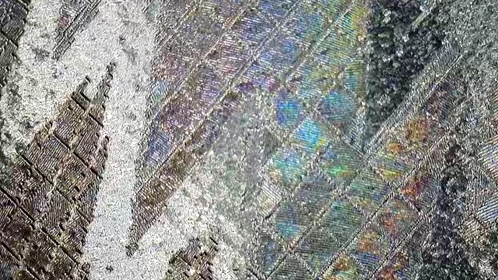

**Video:** [`Diffractionwiz.mp4`](./serverless_web/release-story-media/Diffractionwiz.mp4) — an example fauxlogram whose changing color and appearance become visible as the viewing angle changes.

At one angle it can look surprisingly close to an ordinary MOPA color engraving.

Then you move it.

And it goes completely psychedelic.

The strange part is that the image doesn't simply disappear into rainbow noise. Essentially every region can change color, but the regions change differently enough — and coherently enough — that the image survives.

I can reproduce this on **my** machine.

What I don't know is how well it generalizes to yours.

We'll get back to that.

---

# This started with Ben Krasnow

Before anything else, I need to give proper credit to **Ben Krasnow**.

A huge amount of this project exists because of the MOPA experiments, code, settings, microscopy and methodology he made public:

- [MOPA Laser Stainless Colors](https://github.com/benkrasnow/MOPA_Laser_Stainless_Colors)
- [MOPA Laser Diffraction Gratings](https://github.com/benkrasnow/MOPA_Laser_Diffraction_Gratings)

If you have a MOPA laser and haven't looked through those repositories, you should.

Ben basically left an entire box of MOPA laser tools and data sitting on GitHub with the lid open.

I didn't start building Rasterizer because his approach wasn't working.

**I started building it because it was working.**

---

# Originally, I just wanted color engraving

One of my early experiments using Ben's work was Mario:

The result was exciting.

The workflow was not.

Take an image.

Reduce the colors.

Figure out which colors I could actually produce.

Trace regions.

Get them into LightBurn.

Assign the right settings.

Repeat.

Then another.

Then another.

So I started automating things.

---

# "Why not just generate the LightBurn file?"

That question was probably the point of no return.

Instead of generating an SVG and manually reconstructing the job, Rasterizer began generating `.lbrn2` projects directly.

The basic idea was simple:

**artwork → Rasterizer swatch → tested laser recipe → LightBurn layer**

The recipes come from a LightBurn Material Library, so Rasterizer doesn't need to pretend that my settings are universal.

Your laser settings remain **your** laser settings.

That let me do things like this:

And, after changing how connected regions were handled:

At that stage I thought I was building a raster-to-vector/color tool.

That description did not survive very long.

---

# Then Rasterizer stopped being a rasterizer

The important change was separating two questions that I had originally treated as one:

> **What should the image look like?**

and:

> **What physical geometry should the laser engrave to represent it?**

Those are now independent decisions.

Rasterizer can process artwork using conventional photographic and illustrated-image presets or reinterpret it through abstract transformations such as Structure Tensor Flow, Voronoi and Halftone Newsprint.

But after the image is interpreted, its regions do not have to become ordinary vectors.

They can become:

- **Normal vector geometry**
- **Glyph geometry**
- **Krasnow diffraction-grating geometry**
- Or **different geometry for different swatches in the same image**

That last one is where things get especially interesting.

A magenta region can become diffraction geometry.

A blue region can become glyphs.

A yellow region can remain an ordinary vector.

Or any other color-to-geometry-type arrangement. All inside the same piece of artwork.

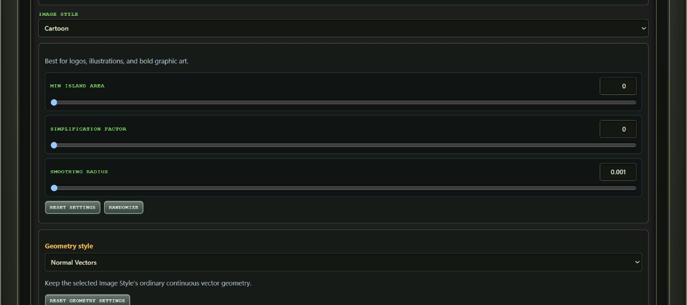

| Source artwork | Skull glyph geometry in LightBurn |
| --- | --- |
| 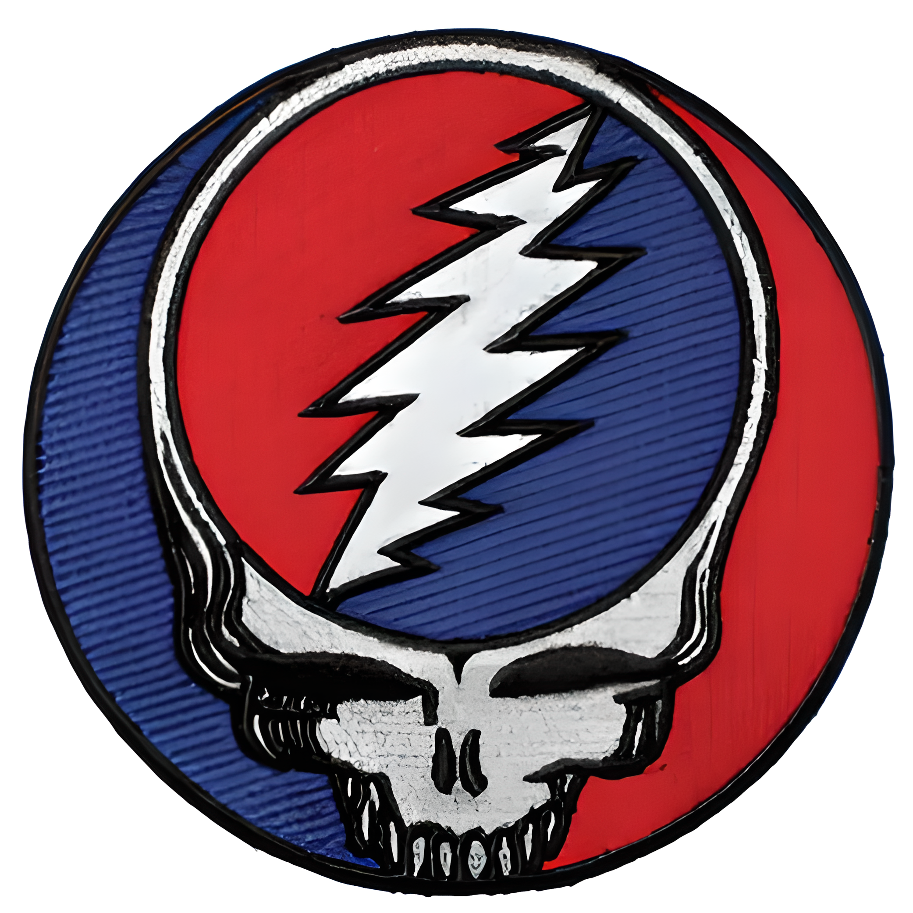 | 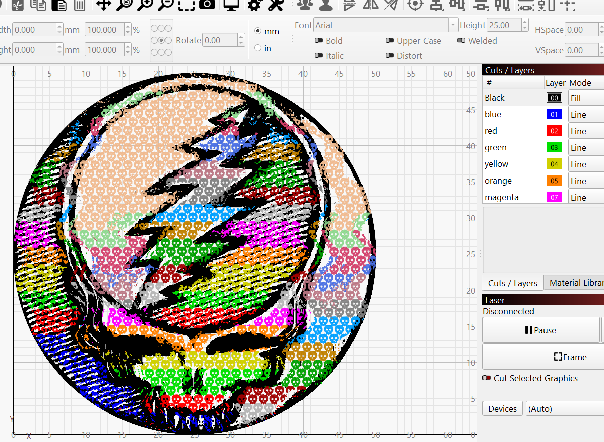 |

**Video:** [`butterfly.mp4`](./serverless_web/release-story-media/butterfly.mp4) — finished butterfly engraving combining swatch-specific geometry treatments.

At some point I realized I had stopped writing an image vectorizer and had started writing something closer to an **image-to-physical-engraving compiler**.

---

# But the bigger problem wasn't processing artwork

Eventually I realized that generating increasingly elaborate artwork was only half the problem.

The harder question was still:

> **How do I discover what the laser can actually produce in the first place?**

That led to what I now think is the more important part of Rasterizer.

Instead of only consuming laser settings, it can help **discover them experimentally**.

The loop is becoming:

> **Discover → Measure → Save → Compose → Engrave → Refine**

And this is where all those test grids finally started earning their keep.

---

# Color Lab: make the test grid part of the software

Color Lab starts from a known LightBurn setting and lets you create controlled parameter sweeps.

Rasterizer generates the LightBurn calibration grid.

You engrave it.

Then you photograph the physical result.

The browser lets you align the photograph with the known grid geometry, then measures the resulting cells locally.

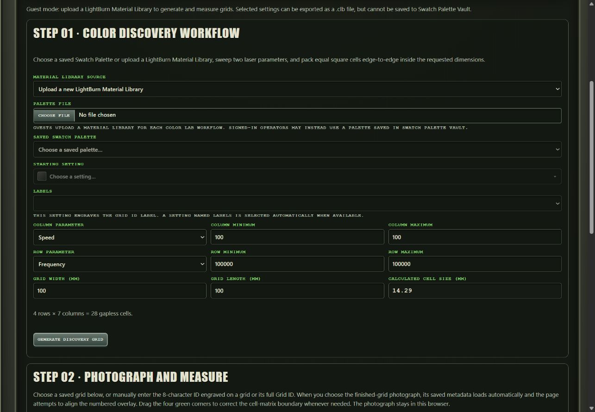

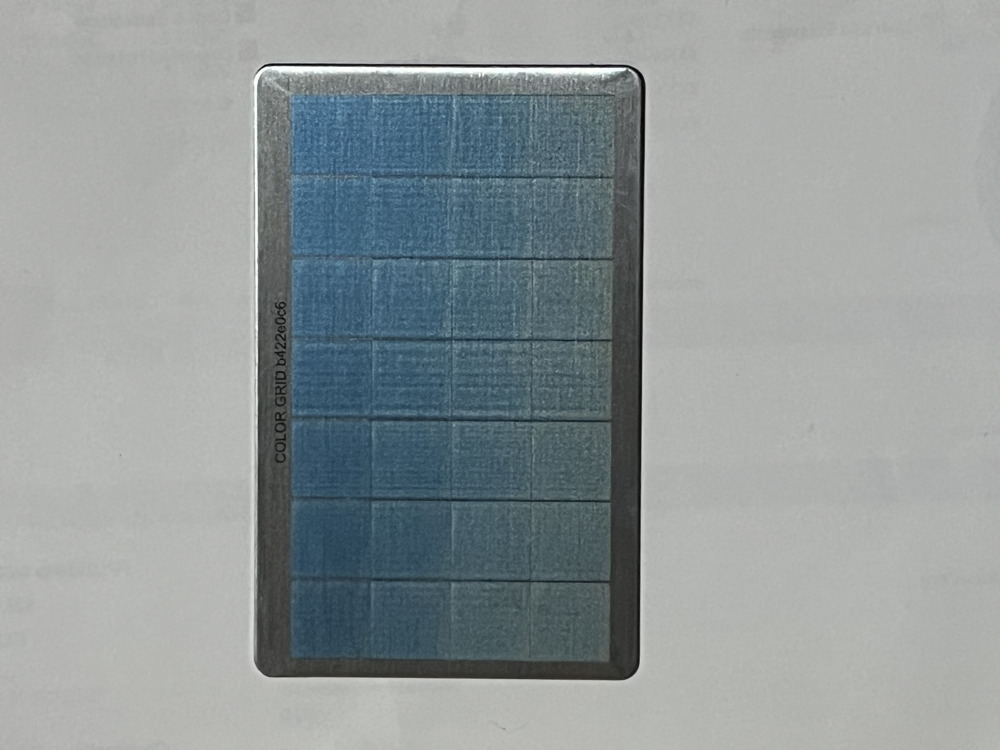

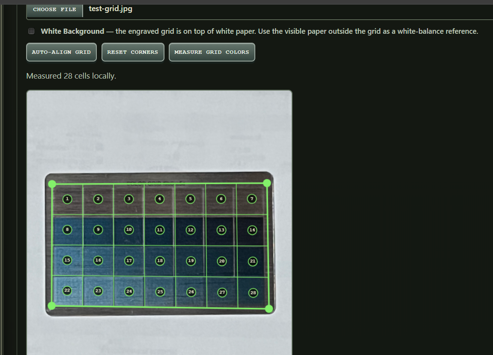

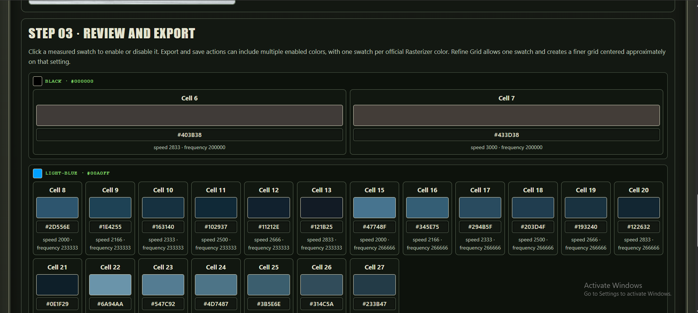

The interesting cells can then be selected and saved as reusable colors.

And if one area looks promising, you don't have to start another giant blind sweep.

You can generate a **refinement grid** around that region and search more narrowly.

So instead of:

> engrave enormous grid → squint at stainless → write something in notebook → eventually lose notebook

the workflow becomes:

> generate experiment → engrave → photograph → measure → keep the useful results → refine around them

This is much closer to how I actually want to experiment with a MOPA.

---

# The Holographic Etching Lab does the same thing to diffraction

The Holographic Etching Lab grew from the same idea, except that it measures angle-dependent diffraction rather than ordinary MOPA color.

Start with an iridescent setting.

Generate a calibration grid that varies parameters such as grating interval and angle, with an optional laser-parameter sweep.

Engrave it.

Photograph it.

Align it.

Measure the cells.

Pick the interesting ones.

Name them.

Save them.

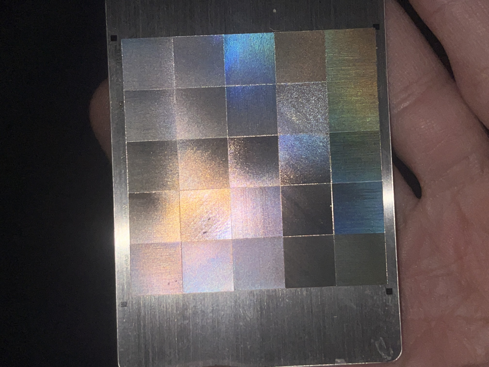

The resulting **Holographic Palette** stores the observed swatches together with the LightBurn layer settings used to produce them.

That distinction matters.

Rasterizer isn't just remembering:

> "this looked purple."

It can remember:

> **"this physical optical result came from this physical engraving recipe."**

Those measured results can then be fed back into Rasterizer and used to process arbitrary artwork.

That closes the loop.

---

# And that brings us back to the oil slick

Long before the Holographic Lab existed, I found this while doing ordinary MOPA experiments:

One setting produced an unusually strong iridescent/oil-slick response.

I saved it because it was obviously doing something interesting.

Later I went back to Ben's diffraction work and noticed a suspicious number.

Ben documented a particularly interesting diffraction operating point at:

**300 mm/s at 300 kHz**

which corresponds to:

**1.00 µm of travel per pulse.**

My strongest independently discovered oil-slick setting works out to approximately:

**1.14 µm per pulse.**

That got my attention.

It is also where I need to be very careful.

**I do not know that approximately one micron is the reason this works.**

Two interesting numbers do not make a law of physics.

Pulse pitch may be important.

Or it may be one variable hiding several other important variables.

Source, lens, focus, material, finish, pulse width, power, frequency, line interval and other factors may all matter.

At this stage I'd rather expose useful experimental variables than pretend I already know which ones matter.

---

# Same image. Very different result.

This is a conventional MOPA color engraving of *Heads* by Ott:

Then I began applying the diffraction ideas that eventually became **Krasnow Grating**.

**Video:** `IMG_4910.mp4`

That was when this stopped being merely another interesting surface finish.

As the viewing geometry changes, essentially every region can shift color.

But the image remains recognizable.

I spent an embarrassing amount of time moving pieces of stainless under different lights.

---

# What Krasnow Grating is doing

The name is deliberate.

It preserves the lineage back to Ben's diffraction-grating work; it does **not** mean the current Rasterizer implementation is simply Ben's algorithm.

Rasterizer uses a tested Holographic setting as an anchor, then varies grating orientation and engraving speed to produce different calculated pulse pitches.

These geometric differences are intended to give neighboring regions different angle-dependent responses.

The goal isn't merely to make the whole surface iridescent.

The interesting behavior happens when neighboring image regions remain **optically distinguishable while all of them are changing**.

Up close, you can see the larger patch structure and different line orientations:

These photographs do **not** resolve individual ~1 µm pulse structure.

They show the larger physical regions and line orientations.

Those region boundaries appear to matter optically: when the boundaries are less distinct, the overall effect is diminished, although I do not yet know exactly why.

---

# Was Heads just lucky?

That was my next question.

So I started throwing other images at it.

**Video:** `IMG_5686.mp4`

**Video:** `IMG_5689.mp4`

**Video:** `IMG_5693.mp4`

**Video:** `IMG_5691.mp4`

Different artwork.

Same basic behavior.

Then I started deliberately playing with the patch geometry:

**Video:** `Triangles-spiritual.mp4`

And eventually:

**Video:** [`IMG_6062.mp4`](./serverless_web/release-story-media/IMG_6062.mp4) — skull-cell diffraction experiment under changing light.

So... why not skulls?

---

# Fauxlographic Palettes and Krasnow Grating are not the same thing

This distinction has become important as Rasterizer has grown.

A **Fauxlographic Palette** is measured experimental knowledge: optical swatches plus the physical LightBurn settings associated with them.

**Fauxlographic artwork mapping** can use those measured swatches to reproduce artwork.

**Krasnow Grating** is a generated diffraction-geometry technique.

And because Image Style and Geometry Style are now independent, Krasnow geometry can also be selectively applied to parts of artwork rather than being the entire processing pipeline.

The two versions in this video were intentionally designed to look different, but together they make the distinction visible.

In the **Fauxlographic Palette** version, the broad optical gradient follows the original shapes and colors in the source artwork. Rasterizer maps those regions to the measured palette entries and uses their stored laser settings, interval and angle without rebuilding the image as shaped grating cells.

In the **Krasnow Grating** version, Rasterizer places geometric patches of parallel grating lines using the selected cell shape and cell size.

Put simply: Fauxlographic Palette artwork is driven by measured laser settings applied to source-color regions. Krasnow Grating combines laser settings with newly generated geometry.

**Video:** [`fauxlographic-vs-krasnow.mp4`](./serverless_web/release-story-media/fauxlographic-vs-krasnow.mp4) — the same source artwork rendered through Krasnow shaped grating cells and Fauxlographic Palette mapping.

That makes the diffraction system much less of a single "effect" and much more of a reusable physical engraving primitive.

---

# Hatch Palettes: color can mean texture instead of color

Another branch of the same idea is **Hatch Palettes**.

A palette can start from one tested Fill/Offset Fill recipe and map Rasterizer swatches to different hatch angles and line intervals.

So source colors don't necessarily mean:

> engrave this region red and this one blue.

They can mean:

> engrave these regions using different physical textures, directions, grain, reflectivity or angular response.

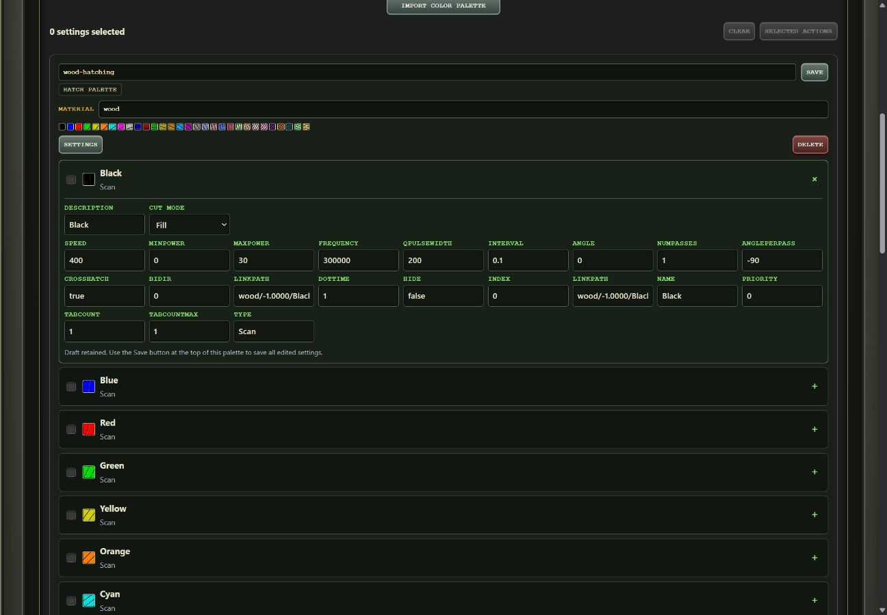

<!-- Future image: physical hatch engraving showing angle/texture differences -->

That makes the swatch system useful even when the desired result has little to do with conventional MOPA oxide color.

---

# Depthmap/Relief Lab: the image can become relative depth data

The Depthmap/Relief Lab is another area that grew far beyond the original Rasterizer.

It can infer relative depth from an ordinary image using **Depth Anything V2 Small**, running locally in the browser.

From there you can adjust the usable depth range, curve and direction, inspect a relief-style preview, paint manual corrections, and export 8-bit or 16-bit depth maps.

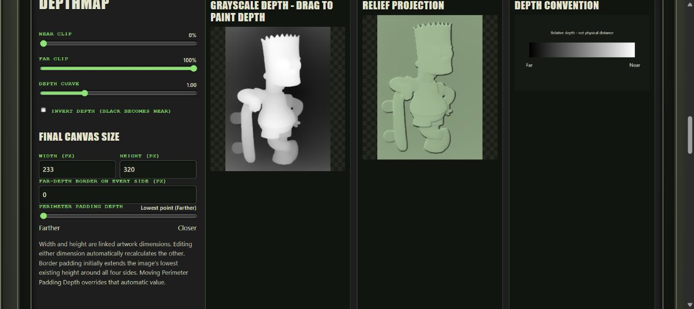

The local-browser part is intentional: your source image doesn't need to be uploaded just to infer depth.

But there's another piece I particularly like.

---

# Sometimes the AI is wrong, but the artist already told us the answer

A **Depth Palette** lets source colors influence the inferred depth.

A swatch can carry a target relative depth and an influence percentage.

At 0%, the depth model wins.

At 100%, the palette assignment wins.

In between, they blend.

That means artwork color can contain semantic information the depth model doesn't understand.

If you already know that a particular color represents a foreground object, Rasterizer doesn't have to blindly trust the AI's interpretation.

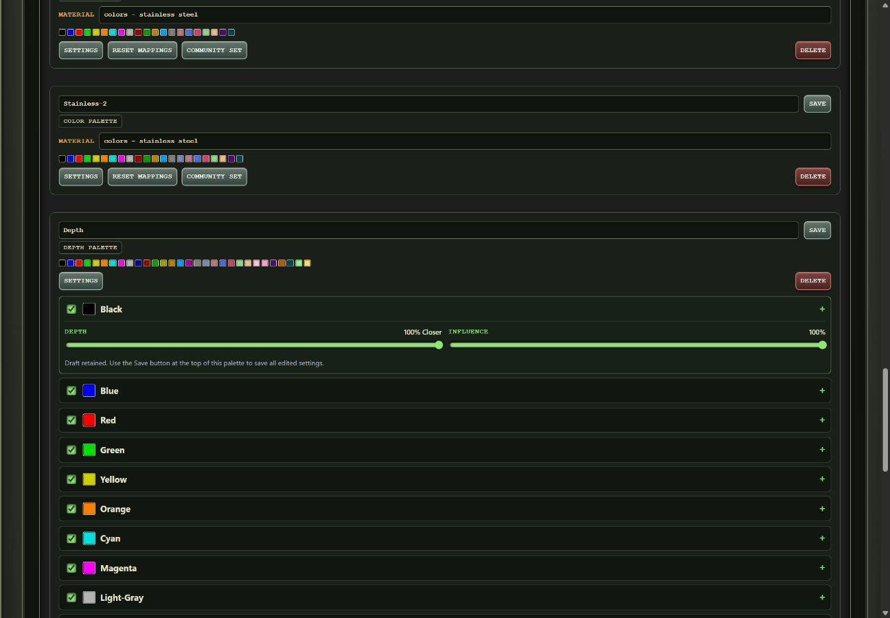

<!-- Future image: before/after depth inference with palette guidance -->

---

# And then depth turns back into diffraction

Because apparently every road in this project eventually leads back to diffraction.

The Depthmap Lab also contains a parallax workflow derived from Ben Krasnow's depth-to-parallax experiments.

An ordinary image can become:

**source image → inferred/edited depth → directional parallax field → diffraction-grating geometry**

The tool can show the depth map, the resulting parallax angle map and the regions that will remain unengraved, then export either the parallax angle map as a PNG or the corresponding diffraction-grating geometry as an SVG.

<!-- Future image: physical parallax/diffraction engraving -->

So something that began as "make a depth map" can end as a physical surface whose grating direction encodes depth.

I did warn you that this got out of hand.

---

# Swatch Palette Vault became the glue holding all of this together

As Rasterizer began storing more than conventional laser recipes, a LightBurn Material Library was no longer broad enough to describe everything in the system.

Rasterizer now has several kinds of reusable knowledge.

**Color / Material Palettes** associate image swatches with physical laser settings.

**Hatch Palettes** associate swatches with directional hatch geometry.

**Depth Palettes** associate swatches with desired relative depth and influence.

**Holographic Palettes** associate measured optical results with the effective engraving recipes that produced them.

The **Swatch Palette Vault** manages these resources.

It can also import LightBurn libraries, edit and reorganize settings, combine selected recipes, export `.clb` libraries and generate labeled LightBurn test coupons.

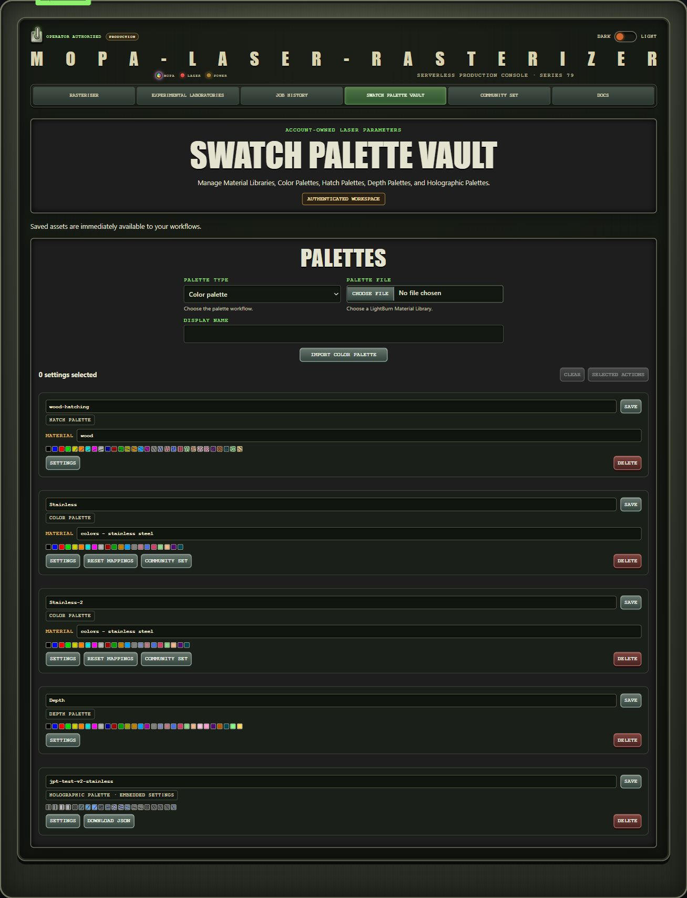

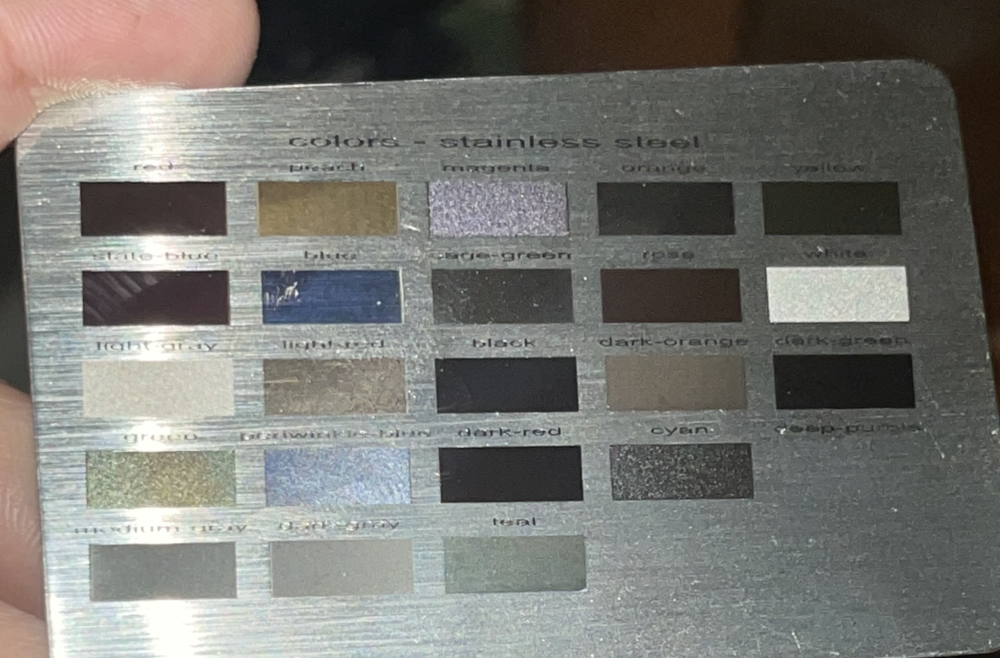

So the experimental result doesn't have to die in a notebook.

It can become an input to the next experiment.

---

# Community Set: somebody else's recipe is a hypothesis, not a promise

There is also now a **Community Set**.

Users can voluntarily publish eligible settings so other people can use them as experimental starting points.

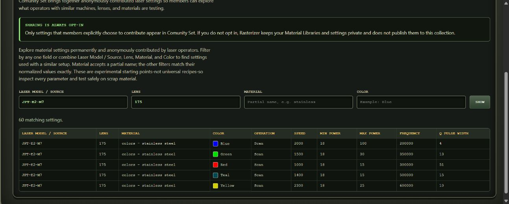

I want to be very explicit about the philosophy here:

> **Somebody else's result is a hypothesis worth testing, not a guaranteed recipe for your machine.**

MOPA color in particular has taught me not to trust universal-setting claims.

Different sources, lenses, focus positions, materials and finishes can behave differently.

But a result from another machine can still be an extremely useful place to begin looking.

Which brings the project right back to why I'm writing this post.

---

# SVG-only mode: you don't have to give Rasterizer your laser recipes

One other design decision is worth calling out.

Rasterizer can operate in **SVG-only mode**.

You can use the image-processing and geometry-generation system without uploading a LightBurn Material Library at all.

That matters if your settings are proprietary, if you use a different downstream workflow, or if you simply want Rasterizer's geometry and plan to handle the machine settings yourself.

LightBurn integration is extremely useful, but the processing system is no longer fundamentally dependent on LightBurn recipes.

---

# Quick Start: the ordinary Rasterizer workflow

The complete documentation covers the different Labs and palette types, but the basic Material-Library-backed Rasterizer workflow is still straightforward.

Rasterizer reduces artwork to named swatches.

For a LightBurn-backed job, it looks inside the selected material for Material Library entries whose **Description matches those swatch names**.

Those entries contain the actual laser settings.

So:

**artwork → Rasterizer swatch → matching Material Library Description → your tested settings → LightBurn layer**

If you don't already have a Rasterizer-ready library, there is a Blank Rasterizer Palette generator:

[Blank Rasterizer Palette Material Library](https://www.mopa-laser-rasterizer.com/docs/blank-palette-library)

The generated settings are deliberately disabled placeholders marked `UNCONFIGURED`.

Replace each swatch you intend to use with a complete setting you have actually tested, remove `UNCONFIGURED` from its entry Description, and leave unused placeholders disabled or delete them.

Rasterizer matches entries inside the selected material by their Description or cut-setting name, regardless of whether LightBurn stores them under a particular thickness. Each swatch label must appear only once in that material; duplicate labels at different thicknesses are still ambiguous.

Existing LightBurn libraries can also be adapted by making their entry Descriptions agree with the Rasterizer swatch names.

Full documentation:

- [Rasterizer documentation](https://www.mopa-laser-rasterizer.com/docs)
- [Blank Palette Library](https://www.mopa-laser-rasterizer.com/docs/blank-palette-library)
- [Material Libraries](https://www.mopa-laser-rasterizer.com/docs/material-libraries)
- [Hatch Palettes](https://www.mopa-laser-rasterizer.com/docs/hatch-palettes)
- [Krasnow Grating](https://www.mopa-laser-rasterizer.com/docs/krasnow-grating-filter)

**[UPDATE NEEDED BEFORE PUBLICATION: add direct links to the new Color Lab, Holographic Lab, Depthmap Lab, Vault and Community Set documentation once production URLs are final.]**

---

# A warning before you turn every knob to maximum

Rasterizer supports workflows where high processing dimensions are legitimate, so the maximum processing dimension can reach **1600 pixels**.

That does not mean every geometry mode should be run at 1600.

In particular, generated diffraction, glyph and other geometry-heavy jobs can create an absurd amount of vector data.

For Krasnow experiments, I still strongly recommend beginning at **400 pixels or below**.

Find out whether the optical effect works.

Then increase resolution because you have a reason, not because the button exists.

With the older diffraction jobs, I've seen 800-pixel projects reach roughly **50–75 MB**, with LightBurn spending **15–30 minutes** preparing them before framing.

At 1600 pixels, generated `.lbrn2` projects can approach **150 MB**.

That is not a 150 MB photograph.

That is roughly 150 MB of vector geometry asking your computer whether it has made peace with its creator.

Rasterizer-generated LightBurn projects automatically disable the expensive cut optimizations while retaining **Order by Layer**, so no manual optimization change is required.

The button exists.

**That is not the same thing as an endorsement.**

---

# What I actually know about the diffraction effect

On my particular laser:

- I have a repeatable operating region that produces unusually strong iridescence.
- My strongest independently discovered oil-slick setting corresponds to roughly **1.14 µm pulse pitch**.
- Rasterizer can use related settings and diffraction geometry to produce regions with different angular responses.
- Those regions can change color dramatically while the underlying image remains recognizable.
- I have reproduced the general behavior with multiple pieces of artwork.
- I have not reproduced the same strength at the other base speed/frequency combinations I have tested.

That last point is why data from other machines matters so much.

---

# What I suspect

I suspect the best operating point is **laser/system dependent**.

Source.

Lens.

Focus.

Material.

Surface finish.

Pulse width.

Power.

Frequency.

Speed.

Line interval.

Probably variables I haven't thought about.

I suspect pulse pitch is one useful way of describing the operating point.

The fact that Ben documented strong diffraction behavior around **1.00 µm**, while my strongest independently discovered setting lands around **1.14 µm**, is interesting.

It is not proof of a universal optimum.

---

# What I absolutely do NOT know

I do not know whether:

- every MOPA source has a similar sweet spot,
- that sweet spot is near 1 µm,
- 1.14 µm is meaningful or coincidence,
- pulse pitch is the dominant variable,
- oxide formation is helping or hurting the optical effect,
- the same behavior appears on different stainless alloys or finishes,
- different lenses move the optimum,
- different focal positions move the optimum,
- or some combination of all of these is responsible.

I have one fiber laser.

That is a terrible sample size.

Fortunately, Rasterizer now has considerably better tools for collecting the next sample.

---

# I need YOUR magic setting

If you own a fiber laser, I would really like you to try this.

But **do not start by targeting my 1.14 µm number.**

Find the strongest iridescent/oil-slick/rainbow setting you can produce on **your own machine**.

Find it independently.

Color Lab, Holographic Lab and ordinary test grids can all help explore the machine, but the important thing is to start from something you have actually observed.

Then calculate the pulse pitch:

**pulse pitch = speed / pulse frequency**

If speed is in mm/s and frequency is in kHz, the numerical result is conveniently in **µm per pulse**.

For example:

**300 mm/s / 300 kHz = 1.00 µm**

Then use that experimentally discovered setting as the starting point for your diffraction work and tell me what happens.

Maybe everyone's magic setting lands around the same place.

Maybe they're all over the map.

Maybe there are multiple useful operating regions.

Maybe the lens matters enormously.

Maybe some MOPA sources simply won't do this.

Maybe nobody else can reproduce it and I'll be forced to conclude I own a magic laser.

All of those results are useful.

---

# If you test this, please report back

Useful information includes:

- Laser/source manufacturer and model
- Rated power
- Lens/focal length
- Stainless type if known
- Surface finish
- Focus position
- Power
- Pulse width
- Frequency
- Base speed
- Calculated pulse pitch
- Line spacing/interval
- Photos or, preferably, video under changing illumination
- Whether the image remains recognizable across viewing angles

Failures matter too.

If yours turns into rainbow soup:

**please report the rainbow soup.**

That tells us something.

And now that Community Set and the calibration/palette tools exist, useful results can eventually become more than forum anecdotes. They can become starting points for other people's experiments.

---

# For my fellow IT nerds: how I tried to make this scale for pennies

There is another rabbit hole behind Rasterizer that has absolutely nothing to do with lasers.

Rasterizer originally ran on **Kubernetes inside WSL on the Intel NUC sitting in my house**, which I use considerably more like a headless server than an actual PC.

That was fine while I was the only person abusing it.

Once I reached the dangerous stage of development where I thought, "I might actually let other people use this," I needed somewhere public to run it.

Naturally, my first solution was:

**More Kubernetes.**

I built a k3s cluster on EC2, deployed Rasterizer with one web pod and two worker pods, and had a real Internet-accessible application.

It cost roughly **$170/month**.

And for my $170, this magnificent distributed-computing platform could process a whopping...

**two jobs simultaneously.**

That was clearly not sustainable for something I wanted to leave online indefinitely and give away for free.

So I started learning the rest of AWS.

The requirement became:

> **When nobody is using Rasterizer, I want to pay for almost nothing. When everybody decides to use it at once, I want AWS to figure it out.**

The production Rasterizer now uses a mostly serverless design.

The browser application is static content behind **CloudFront and private S3**.

The authenticated API runs in **ARM Lambda behind API Gateway**.

Large artwork uploads go **directly from the browser to private S3 using short-lived presigned uploads** rather than being shoved through Lambda.

Job/account state lives in **DynamoDB on-demand**.

Processing jobs enter **SQS** and are orchestrated through **EventBridge Pipes and Step Functions**.

The expensive raster work happens in **one-shot ECS Fargate tasks**.

There is no permanently running raster worker.

A worker exists because somebody submitted a job.

It appears, downloads its inputs, does the expensive work, writes the results back to S3, updates job state and disappears.

The workflow tries **Fargate Spot twice** because it is cheaper, then automatically falls back to ordinary on-demand Fargate if Spot doesn't cooperate. If all attempts fail, the task ends up in a dead-letter queue instead of evaporating somewhere inside AWS.

Grossly simplified:

**browser → API/S3 → DynamoDB/SQS → orchestration → disposable Fargate worker → S3**

Temporary job artifacts expire automatically, durable palettes remain, DynamoDB is pay-per-request, ECR images have lifecycle policies, and private S3/DynamoDB traffic uses Gateway VPC Endpoints instead of paying for a NAT Gateway just to talk to AWS.

Every component eventually got the same question:

> **What is the cheapest AWS service that can do this reliably without making the application suck?**

All of this ridiculous infrastructure work ultimately serves one requirement:

**I want Rasterizer to stay free.**

As long as it doesn't unexpectedly become the next big thing, I should be able to absorb the cost.

And if thousands of people suddenly decide they desperately need to turn photographs into microscopic diffraction gratings on stainless steel...

Well.

That would be a much more entertaining scaling problem to have.

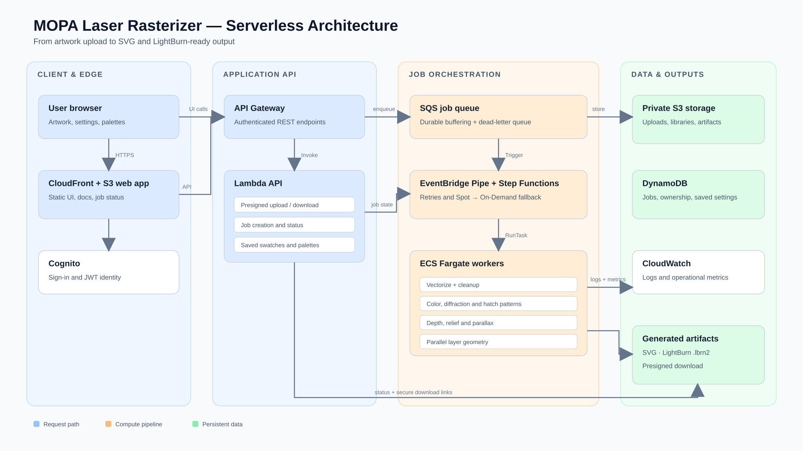

*Rasterizer's scale-to-zero AWS architecture, from browser upload through disposable Fargate processing and secure artifact delivery.*

---

# Releasing what Rasterizer has become

So after all of this, I'm releasing the application, MOPA-LASER-RASTERIZER.

Calling it a rasterizer is increasingly questionable, but the name has stuck.

It can still take an ordinary image and generate a LightBurn color engraving.

But it can also help you **discover** what your laser does.

It can **measure** the result of a physical experiment.

It can **save** that result as reusable knowledge.

It can **compose** new artwork from those measured behaviors.

It can turn image regions into vectors, glyphs, halftones, hatch textures or diffraction gratings.

It can infer and edit depth.

It can turn depth into parallax geometry.

It can spatially mix physical colors.

It can generate calibration grids and LightBurn coupons.

It can keep your experimentally discovered palettes organized.

And it can give other MOPA owners a starting point for repeating an experiment without pretending that anybody's settings are universal.

The shortest description I have for the philosophy now is:

> **Discover → Measure → Save → Compose → Engrave → Refine**

This is not a polished commercial product built around a marketing plan.

It is the software that accumulated because I kept asking increasingly inconvenient questions of a laser.

And I have reached the point where the most interesting questions can't be answered with more software.

They require different MOPA sources.

Different lenses.

Different power levels.

Different stainless.

Different focus positions.

Different independently discovered colors.

Different diffraction sweet spots.

Different failures.

Different rainbow soup.

I can keep engraving more stainless on my machine.

What I cannot manufacture is diversity of hardware.

So if any of this sounds interesting, try it.

Start small.

Inspect every generated LightBurn setting before firing the laser.

Treat other people's recipes as experimental starting points, not universal truth.

Measure what your own machine actually does.

Save the interesting things.

Refine them.

And please tell me what happens.

If the diffraction relationship generalizes, I think that is extremely interesting.

If the magic number moves all over the place, that is extremely interesting too.

If Color Lab starts revealing patterns across different MOPA sources, I want to see them.

If the Holographic Lab finds completely different optical operating regions on different lenses, that's useful data.

And if absolutely nobody can reproduce what my laser is doing...

I suppose I will accept my new responsibility as caretaker of the magic laser.

Either way:

**I need your lasers.**

**— The Wizzard of Awes**
